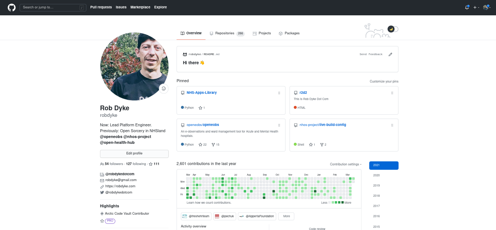
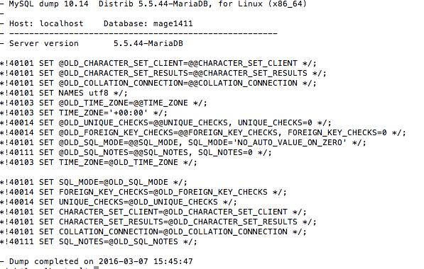

# Security Disclosure to Organisation

## IMMEDIATE ACTION STRONGLY ADVISED

- The thing you need to fix 1
- The thing you need to fix 2
- The thing you need to fix 3

## IMMEDIATE ACTION STRONGLY ADVISED

### The thing you need to fix 1

Leverage agile frameworks to provide a robust synopsis for high level overviews. Iterative approaches to corporate strategy foster collaborative thinking to further the overall value proposition. Organically grow the holistic world view of disruptive innovation via workplace diversity and empowerment.




## IMMEDIATE ACTION STRONGLY ADVISED

### The thing you need to fix 2

Bring to the table win-win survival strategies to ensure proactive domination. At the end of the day, going forward, a new normal that has evolved from generation X is on the runway heading towards a streamlined cloud solution. User generated content in real-time will have multiple touchpoints for offshoring.



## IMMEDIATE ACTION STRONGLY ADVISED

### The thing you need to fix 3

Capitalize on low hanging fruit to identify a ballpark value added activity to beta test. Override the digital divide with additional clickthroughs from DevOps. Nanotechnology immersion along the information highway will close the loop on focusing solely on the bottom line.

```json
{
    "name": "common/framework",
    "version": "v5.6.29",
    "source": {
        "type": "git",
        "url": "https://github.com/common/framework.git",
        "reference": "acc6b5c54ab196d335acc6b5c54ab196d335"
        }
}
```

There are multiple security alerts for Common framework. These  can be found at https://packagist.org/packages/common/framework/advisories

### Date / Time range of these things

- First commit 2016-06-03T08:14:14 -01:00


### Impact on other stuff

- Other stuff 1
- Other stuff 2
- Other stuff 3

### Other stuff 1

Podcasting operational change management inside of workflows to establish a framework. Taking seamless key performance indicators offline to maximise the long tail. Keeping your eye on the ball while performing a deep dive on the start-up mentality to derive convergence on cross-platform integration.

## IMMEDIATE ACTION STRONGLY ADVISED

## Recommended actions

- Do this thing
- Do this thing
- And this thing


### Data Breach Assessment

Collaboratively administrate empowered markets via plug-and-play networks. Dynamically procrastinate B2C users after installed base benefits. Dramatically visualize customer directed convergence without revolutionary ROI.

### Data Breach Reporting

You may need to notify the ICO of this breach.

